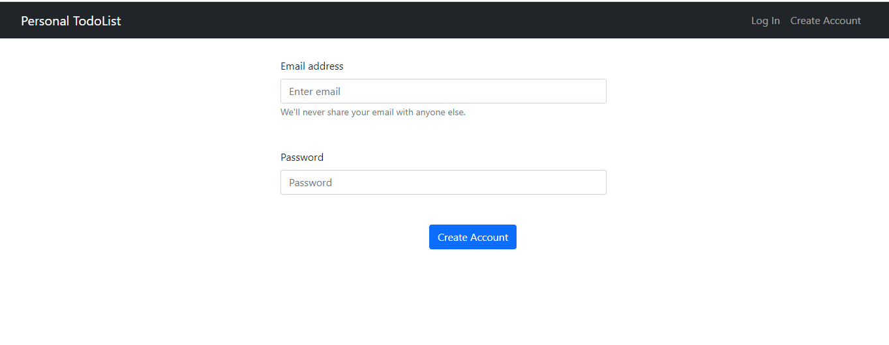
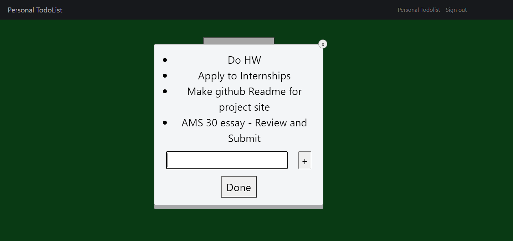
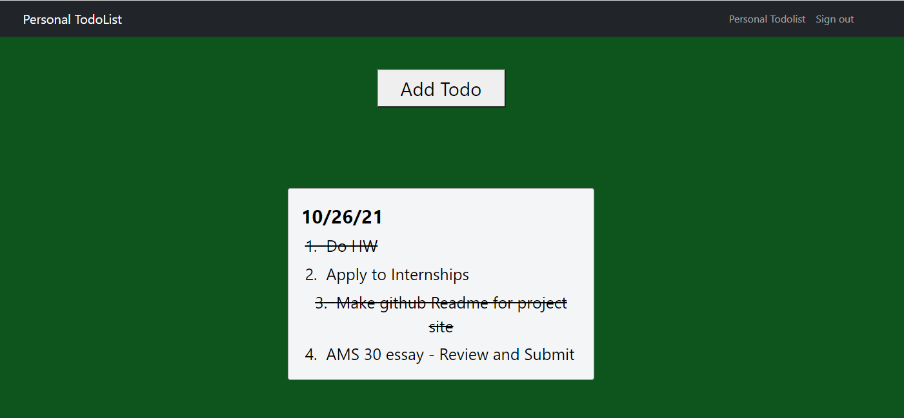

# Personal Todolist website
Hosted on: https://personal-daily-todolist.herokuapp.com/

# Frameworks used
React JS in front end + Python Flask in backend

# Website Description
A potential user who does not have an account can sign up on the sign up page: 

Once the user has signed up and logged in, they are directed to their personal dashboard, where they can start adding todos: 

As you can see, they can add their todos for a day. Each todo block is labeled by the date of creation. Once a user finishes some of their todos, just by clicking on the text, they can cross them out: 

