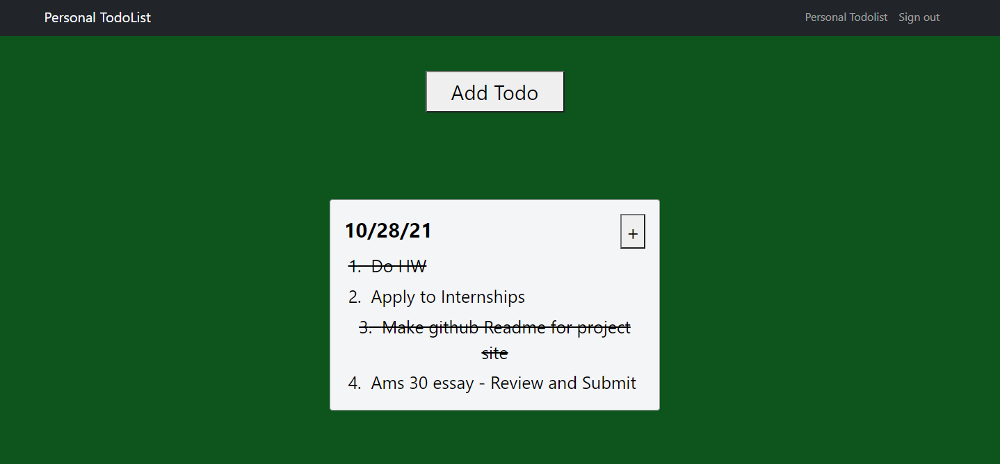
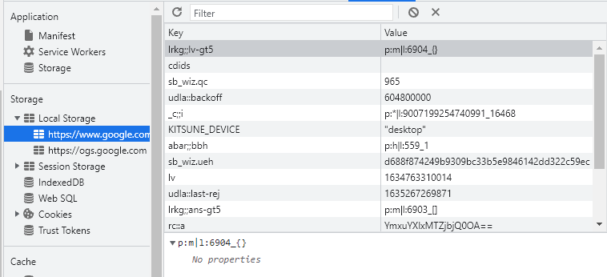

# Personal Todolist website
Hosted on: https://personal-daily-todolist.herokuapp.com/
This site was created largely for myself: Every day I used to write down the things that I had to do. This would be time consuming and would often be something I dreaded doing every night. One day, I realized that if I typed them out on some platform, and designed that platform to have custom features that fit my specific needs, then I could finish writing todos in as little as 2 minutes. Now, this is exackly the case: the site is so well designed towards my specific needs that writing todos no longer takes the 15-20 minutes that it used to!

# Frameworks used
React JS in front end + Python Flask in backend + sqlite3 for the database.

# Website Description
A potential user who does not have an account can sign up on the sign up page: 

Once the user has signed up and logged in, they are directed to their personal dashboard, where they can start adding todos: 

As you can see, they can add their todos for a day. Each todo block is labeled by the date of creation. Once a user finishes some of their todos, just by clicking on the text, they can cross them out: 

# How I made it
There were three basic components of the website: the database, the backend REST api, and the front end.

# The Database
I used the sqlite3 to create the database. While this package is not useful when creating large scale application with lots of users, it is very convinient for small personal projects.

This website has three database tables: User, Todo, Entry. The User table represents all the users that have signed up and use the site. The Todo table represents a todolist created by a particular user on a particular day. The Entry table represents an entry that is apart of a todolist. 

The User table has a one to many relationship with the Todo table (one user can have many todos), which in turn has a one to many relationship with the Entry table (one todo can have many entries).

The biggest challenge when designing the database was thinking of the best way to organize the tables. While now its obvious that the main components of this website are the users, the todos, and the entries of those todos, in the beginning it was not as clear to me. I spent quite a bit of time reading the sqlite docs and figuring out all the functionality that they provide. 

# The Backend
I decided to design the backend API using REST, and program it using Python Flask. This was one of my favorite things to work on this project, as there were many "Aha" moments as I learned about this kind of design. 

RESTful API's define how the client and server of a site interact. The client (the part of the website the user sees) often needs to read or write information that is only stored on the database, and thus queries the backend. In these queries, the client essentially asks a question and gives a command to the server. For example, if the user just logs in, then the client is asking the backend what todos the user has. The backend then asks the database, and takes the databases' respond and gives it back in JSON form. If the user creates a new todolist or entry, the client will tell the backend to add that to the database. 

The biggest thing I learned while reading about REST API design best practices is that these API's are designed around resources. On this todolist website, the three resources are the Users, Todos, and Entries (its worth noting that I shouldn't have defined these resources as being the exact three objects stored in my database). For each resource, there are in general four kinds of commands that REST api's can do to them: POST (add a new object of that resource), GET (get a particular object of that resource), PUT (update an particular object), and DELETE (delete a particular object). 

A REST API will define an endpoint around each resource, which is essentially just a url that the client calls in order to tell the backend that it specifically wants to do something with that resource. When it calls that endpoint, it specifies what kind of call its making (POST, GET, PUT, DELETE). On our website, if the client wants to get a particular todo of a user, then it makes a GET request to the /api/todo endpoint. If the client wants to add a new user, it makes a POST request to the /api/user endpoint.

Learning the above was especially useful for me, as I used to design endpoints such as /api/getParticularUser or /api/createTodo. This is bad practice, as it results in many api endpoints. REST API's are designed to be lightweight and effecient, meaning there are minimal endpoints and everything is as optimized as possible.

# The Front End
Another big motivation I had for doing this project was to learn React. React is a very useful front end library because it allows programmers to design sites around reusable components such as Buttons and Textfields (note how this is similar to how a well designed REST api is designed around resources). 

There were many different things I learned about React, but one of the most useful was hooks. React hooks are what allow the front end to rerender whenever something changes. For example, if I have a Todolist component, and a new entry is added, I would want the Todolist that the user sees to be rerendered immediatly. This is only possible in React if you make a hook for that Todolist component, as React uses a Virtual DOM. I learned and re-learned this lesson multiple times throughout the project, as I kept running into the problem of forgetting to make a hook for a front end component. 

Finally, one of the suprisignly most fascinating things I learned htrough this project was how user authentication works. When a user logs into a website, its easy to take it for granted that when you reload the site, or open a new tab, you are still signed in. This is unintuitive as a programmer, as during a reload or opening of a new tab, the code is also reloaded. Thus, any information stored in variables is lost. 

How then to keep track of the logged in user? The answer is through using local storage. In Javascript, you can store information to a browser through using local or session storage. This information is not cleared even when the page is reloaded or a new tab is created. Hence, when a user logs in, an easy way to keep track of them is to store some form of identification on local storage. You can see what any website stores in local storage through doing Inspect Element - Application - Local Storage. Here is an example from google: 
